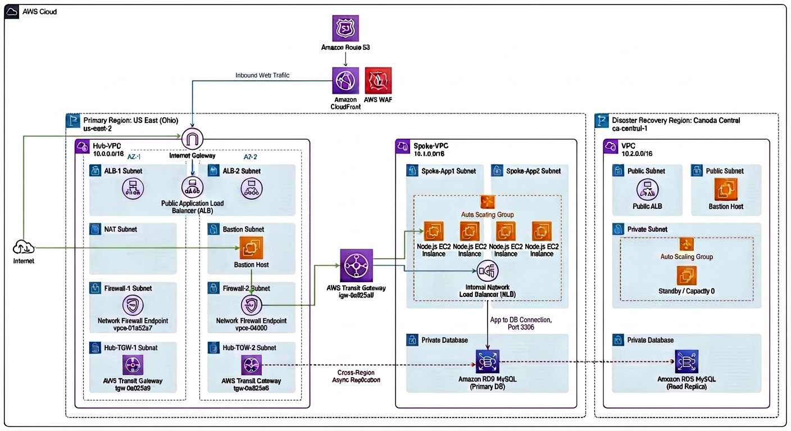

# 🚀 Enterprise Employee Management Application on AWS (Migration, DR, Security Automation & IaC)

A production-ready Enterprise AWS solution featuring **Live Application Migration**, **Multi-Region Disaster Recovery**, **Hub-and-Spoke Network Architecture**, **Stateful Traffic Inspection**, **Automated Threat Response**, and **Infrastructure as Code (IaC)** using **AWS CloudFormation**.

The solution was built following the **AWS Well-Architected Framework** principles and simulates a real-world enterprise environment spanning two AWS Regions:

- **Primary Region:** US East (Ohio) (`us-east-2`)
- **Disaster Recovery Region:** Canada (Central) (`ca-central-1`)

Incoming internet traffic is optimized via **Amazon CloudFront**, protected at Edge by **AWS WAF**, routed through an **Internet-facing Application Load Balancer (ALB)**, deeply inspected by **AWS Network Firewall**, routed across **AWS Transit Gateway (TGW)** to an **Internal Network Load Balancer (NLB)**, and distributed across EC2 instances inside an **Auto Scaling Group**. The database utilizes **Amazon RDS MySQL Multi-AZ** with **Cross-Region Asynchronous Read Replication**.



---

# 📖 Project Overview

This project demonstrates how to migrate, secure, scale, automate, and operate a full-stack production application on AWS.

The solution transforms a legacy single-server application into a highly available, self-healing, multi-region architecture. The complete network and compute infrastructure is provisioned using **AWS CloudFormation**, incorporating automated incident response workflows through **Amazon GuardDuty**, **AWS Security Hub**, **Amazon EventBridge**, and **AWS Lambda**.

---

# 🎯 Project Objectives

- **Live Application Migration:** Migrate an on-premises web application to AWS using **AWS Application Migration Service (MGN)** with minimal downtime.
- **Enterprise Network Segmentation:** Implement a secure **Hub-and-Spoke** architecture using **AWS Transit Gateway**.
- **Centralized Security Inspection:** Perform deep packet inspection on all inbound/outbound traffic using **AWS Network Firewall**.
- **High Availability & Self-Healing:** Eliminate single points of failure across multiple Availability Zones using **ALB**, **Internal NLB**, **Auto Scaling Groups**, and **RDS Multi-AZ**.
- **Multi-Region Disaster Recovery:** Safeguard business continuity using **RDS Cross-Region Read Replica** with promotion-on-failure capabilities.
- **Automated Incident Response:** Detect threats via **GuardDuty** & **Security Hub**, triggering **EventBridge** and **Lambda** to isolate compromised compute nodes automatically.
- **Edge Security & CDN Acceleration:** Protect against web exploits via **AWS WAF** managed rule sets and reduce application latency using **Amazon CloudFront**.
- **Infrastructure as Code:** Automate the entire infrastructure provisioning cycle using modular **AWS CloudFormation** templates.

---

# 🏗 Architecture Diagram

                        [ Internet Users ]
                                │
                                ▼
                       [ Amazon CloudFront ]
                                │
                                ▼
                           [ AWS WAF ]
                                │
                      [ Internet Gateway ]
                                │
                ┌───────────────┴───────────────┐
                │        PRIMARY REGION         │
                │    US East (Ohio) us-east-2   │
                └───────────────┬───────────────┘
                                │
                   [ Application Load Balancer ] (Hub VPC)
                                │
                    [ AWS Network Firewall ] (Hub VPC)
                                │
                    [ AWS Transit Gateway ]
                                │
                   [ Internal Network Load Balancer ] (Spoke VPC)
                                │
                   [ Auto Scaling Group (EC2) ] (Spoke VPC)
                                │
                    [ Amazon RDS MySQL Multi-AZ ]
                                │
                     (Cross-Region Replication)
                                │
                                ▼
                ┌───────────────┴───────────────┐
                │   DISASTER RECOVERY REGION    │
                │  Canada (Central) ca-central-1│
                └───────────────┬───────────────┘
                                │
                   [ RDS Cross-Region Read Replica ]

# 🌐 Network Architecture & Design

The primary region infrastructure is isolated into two Virtual Private Clouds (VPCs):

1. **Hub VPC (`10.0.0.0/16`)** – Acts as the centralized entry point, hosting ingress load balancers, egress gateways, management bastions, and inspection firewalls.
2. **Spoke VPC (`10.1.0.0/16`)** – Hosts private application compute nodes and database workloads with zero direct internet access.

Both VPCs interconnect securely through **AWS Transit Gateway (TGW)**.

---

## Hub VPC Breakdown

- **VPC Name:** `Hub-VPC`
- **CIDR Block:** `10.0.0.0/16`

### Subnet Layout

| Subnet Name         | CIDR Block    | Availability Zone | Purpose                                   |
| :------------------ | :------------ | :---------------- | :---------------------------------------- |
| **ALBSubnetA**      | `10.0.0.0/24` | `us-east-2a`      | Internet-facing Application Load Balancer |
| **ALBSubnetB**      | `10.0.1.0/24` | `us-east-2b`      | Internet-facing Application Load Balancer |
| **FirewallSubnetA** | `10.0.2.0/24` | `us-east-2a`      | AWS Network Firewall Endpoint             |
| **FirewallSubnetB** | `10.0.3.0/24` | `us-east-2b`      | AWS Network Firewall Endpoint             |
| **TGWSubnetA**      | `10.0.4.0/24` | `us-east-2a`      | Transit Gateway Attachment Endpoint       |
| **TGWSubnetB**      | `10.0.5.0/24` | `us-east-2b`      | Transit Gateway Attachment Endpoint       |
| **JumpSubnet**      | `10.0.6.0/24` | `us-east-2a`      | Administrative Bastion (Jump Server)      |
| **NATSubnet**       | `10.0.7.0/24` | `us-east-2a`      | NAT Gateway for Outbound Egress           |

### Core Hub Resources

- **Internet Gateway (`Hub-IGW`):** Handles external communication for public subnets.
- **Application Load Balancer (`Ahmed-ALB`):** Receives HTTPS/HTTP traffic from CloudFront and targets the private ENI IP addresses of the Internal NLB.
- **AWS Network Firewall (`Ahmed-FW`):** Positioned between the ALB and Transit Gateway for stateful traffic filtering.
- **NAT Gateway (`Hub-NATGW`):** Provides private Spoke instances with secure outbound access for updates/patches.
- **Jump Server (`Jump-Server`):** Hardened EC2 instance providing secure administrative SSH access to the private application instances.

---

## Spoke VPC Breakdown

- **VPC Name:** `Spoke-VPC`
- **CIDR Block:** `10.1.0.0/16`

### Subnet Layout

| Subnet Name    | CIDR Block    | Availability Zone | Purpose                                    |
| :------------- | :------------ | :---------------- | :----------------------------------------- |
| **AppSubnetA** | `10.1.0.0/24` | `us-east-2a`      | Private Application Servers & Internal NLB |
| **AppSubnetB** | `10.1.1.0/24` | `us-east-2b`      | Private Application Servers & Internal NLB |
| **TGWSubnetA** | `10.1.2.0/24` | `us-east-2a`      | Transit Gateway Attachment Endpoint        |
| **TGWSubnetB** | `10.1.3.0/24` | `us-east-2b`      | Transit Gateway Attachment Endpoint        |

### Core Spoke Resources

- **Internal Network Load Balancer (`Ahmed-NLB`):** Layer-4 pass-through load balancer routing high-throughput traffic directly to application nodes.
- **Auto Scaling Group (`Ahmed-ASG`):** Automatically provisions and terminates EC2 application instances based on demand and health status (Min: 2, Desired: 2, Max: 4).
- **Amazon RDS MySQL:** Multi-AZ deployment spanning private subnets with automated backups and cross-region replication.

---

# 🔀 Detailed Traffic Engineering

## 1. Inbound Ingress Traffic Flow

Markdown

# 🔀 Detailed Traffic Engineering

## 1. Inbound Ingress Traffic Flow

User Request
│
▼
[ Amazon CloudFront ] (Global Edge Caching & TLS Termination)
│
▼
[ AWS WAF ] (Inspects SQLi, XSS, Bad IPs)
│
▼
[ Internet Gateway ]
│
▼
[ Ahmed-ALB ] (Hub Public Subnets 10.0.0.0/24 & 10.0.1.0/24)
│
▼
[ AWS Network Firewall ] (Inspects Hub -> Spoke Traffic)
│
▼
[ Transit Gateway (TGW) ] (Hub Attachment -> TGW Route Table -> Spoke Attachment)
│
▼
[ Ahmed-NLB ] (Spoke Private Subnets 10.1.0.0/24 & 10.1.1.0/24)
│
▼
[ Target Group / Auto Scaling EC2 Instances ] (Runs Node.js App Port 80)
│
▼
[ Amazon RDS MySQL ] (Primary DB Port 3306)

---

## 2. Outbound Egress Traffic Flow (Updates / External APIs)

[ Private EC2 Instance ]
│
▼
[ Transit Gateway (TGW) ]
│
▼
[ AWS Network Firewall ] (Stateful Egress Rule Evaluation)
│
▼
[ NAT Gateway ] (Hub NAT Subnet 10.0.7.0/24)
│
▼
[ Internet Gateway ] -> [ External Internet ]

---

## 3. Administrative SSH Management Flow

Administrator
│
▼
[ Internet Gateway ]
│
▼
[ Jump Server ] (Hub Subnet 10.0.6.0/24)
│
▼
[ AWS Network Firewall ] (Inspects SSH Traffic Port 22)
│
▼
[ Transit Gateway (TGW) ]
│
▼
[ Private EC2 Application Nodes ] (Port 22)

---

# 🛡 Security Architecture & Automation

The infrastructure follows a multi-layered **Defense-in-Depth** model:

+-------------------------------------------------------------------+
| 1. EDGE SECURITY: Amazon CloudFront + AWS WAF |
+-------------------------------------------------------------------+
| 2. NETWORK INSPECTION: AWS Network Firewall + Security Groups |
+-------------------------------------------------------------------+
| 3. COMPUTE ISOLATION: Private Subnets + IAM Roles (No Keys) |
+-------------------------------------------------------------------+
| 4. AUTOMATED THREAT RESPONSE: GuardDuty -> Security Hub -> |
| EventBridge -> AWS Lambda |
+-------------------------------------------------------------------+

### AWS WAF Protection Rules

- `AWSManagedRulesAmazonIpReputationList`
- `AWSManagedRulesCommonRuleSet`
- `AWSManagedRulesKnownBadInputsRuleSet`
- `AWSManagedRulesSQLiRuleSet`

### Stateful Firewall Rule Policies

AWS Network Firewall enforces explicit rule pass-lists:

- **Port 22 (SSH):** Allowed strictly from `JumpSubnet` (`10.0.6.0/24`) to `Spoke VPC` (`10.1.0.0/16`).
- **Port 80/443 (HTTP/S):** Allowed between `ALB Subnets` and `Spoke VPC`.
- **Port 53 (DNS):** Allowed for internal UDP/TCP queries.
- **Implicit Deny:** All unmapped inter-VPC traffic is dropped.

### Event-Driven Incident Response Pipeline

1. **Detection:** **Amazon GuardDuty** continuously monitors VPC Flow Logs, DNS logs, and CloudTrail events.
2. **Aggregation:** Findings flow directly to **AWS Security Hub**.
3. **Trigger:** An **Amazon EventBridge** rule evaluates findings for High/Critical severity conditions.
4. **Remediation:** An **AWS Lambda** function is invoked to parse the affected EC2 Instance ID and execute an automated API call (`ec2:StopInstances`) to isolate the target immediately for forensic analysis.

---

# 💻 Source Application Architecture & Stack

Prior to cloud migration, the legacy application was provisioned and configured on an Amazon Linux 2023 host with a local MariaDB database and a Node.js Express application structure.

The complete Node.js application codebase and SQL initialization scripts are organized within the repository directory structure:

- **Environment Variables:** Located in [`.env`](./.env)
- **Application Core:** Located in [`app.js`](./app.js)
- **Database Connection Module:** Located in [`db.js`](./db.js)
- **Route Handlers:** Located in [`employee.js`](./employee.js)
- **UI Templates:** Located in [`index.ejs`](./index.ejs) & [`add.ejs`](./add.ejs)

### 1. Database Schema & Initial Seeding (MariaDB / MySQL)

````sql
CREATE DATABASE company;
CREATE USER 'employee'@'localhost' IDENTIFIED BY 'Employee@123';
GRANT ALL PRIVILEGES ON company.* TO 'employee'@'localhost';
FLUSH PRIVILEGES;

USE company;

CREATE TABLE employees (
    id INT AUTO_INCREMENT PRIMARY KEY,
    name VARCHAR(100) NOT NULL,
    department VARCHAR(100) NOT NULL,
    salary DECIMAL(10,2) NOT NULL,
    created_at TIMESTAMP DEFAULT CURRENT_TIMESTAMP
);

INSERT INTO employees(name, department, salary)
VALUES
('Ahmed', 'Cloud', 8000),
('Sara', 'HR', 6500),
('Ali', 'DevOps', 9000);
````
---

### 2. Application Structure & Key Configurations

employee-app/
├── app.js               # Express Server & Middleware Configuration
├── db.js                # MySQL2 Connection Pool setup via dotenv
├── .env                 # Environment Variables (DB Host, Port, Credentials)
├── package.json         # Node.js Dependencies (express, ejs, mysql2, dotenv)
├── routes/
│   └── employee.js      # CRUD Route Handlers (GET /, GET /add, POST /add)
└── views/
    ├── index.ejs        # Dashboard UI (Bootstrap 5)
    └── add.ejs          # Employee Registration Form


Environment Variables (.env)
Note: Post-migration, DB_HOST is updated from localhost to the active Amazon RDS Endpoint.

---

### 3. Application Process Management (`systemd` Service Integration)

To ensure high availability, automatic startup on boot, and process resilience, the Node.js application was configured as a background system daemon managed by **Linux `systemd`**.

#### Systemd Service Unit File (`/etc/systemd/system/employee-app.service`)

```ini
[Unit]
Description=Employee Management Application
After=network.target mariadb.service

[Service]
Type=simple
User=ec2-user
WorkingDirectory=/home/ec2-user/employee-app
ExecStart=/usr/bin/node /home/ec2-user/employee-app/app.js
Restart=always
RestartSec=10
Environment=NODE_ENV=production

[Install]
WantedBy=multi-user.target


### Service Verification Commands:

# Reload daemon and enable auto-start on boot
sudo systemctl daemon-reload
sudo systemctl enable employee-app

# Start and verify process status
sudo systemctl start employee-app
sudo systemctl status employee-app

# Verify logs via journalctl
sudo journalctl -u employee-app -f

Operational Impact: Configuring systemd ensured that when AWS Application Migration Service (MGN) replicated the server and when the Auto Scaling Group spun up new EC2 nodes, the Node.js application automatically initialized and bound to Port 3000 without manual administrator intervention.


---


# 🚚 Application Migration Strategy (AWS MGN)

The original Employee Management System was migrated using **AWS Application Migration Service (MGN)**:

1. **Agent Installation:** Installed the AWS Replication Agent on the legacy source server.
2. **Continuous Block-Level Replication:** Replicated disk volumes asynchronously into the staging area in `us-east-2`.
3. **Test Launch:** Non-disruptive testing of the migrated instance inside isolated subnets to verify Node.js runtime and DB connections.
4. **Cutover Execution:** Final synchronization followed by cutover launch.
5. **AMI Creation:** The cutover instance was sanitized and saved as an **Amazon Machine Image (AMI)**, which now serves as the base image inside the CloudFormation **Launch Template**.


---


# 🔄 Post-Migration Application Refactoring & Infrastructure Scaling

After successfully completing the live migration of the source server via **AWS Application Migration Service (MGN)**, the application tier was refactored to decouple compute from the database layer and transition into a stateless, scalable architecture.

### Step-by-Step Refactoring & Promotion Process:

1. **Initial Migration Instance Launch:**
   - The migrated source server instance was launched inside the **Spoke VPC** (`Spoke-VPC`).
   - At this stage, the application was still configured to connect to the local database (`DB_HOST=localhost`).

2. **Database Decoupling & RDS Integration:**
   - An initial temporary **Amazon Machine Image (AMI)** was created from the migrated instance and launched via a temporary Launch Template.
   - The application environment configuration (`.env`) was updated on the instance to replace the local database with the **Amazon RDS MySQL Endpoint**:
     ```env
     # Old Configuration (Local DB):
     # DB_HOST=localhost

     # New Production Configuration (Decoupled Managed RDS):
     DB_HOST=company.c123456789.us-east-2.rds.amazonaws.com
     DB_USER=employee
     DB_PASSWORD=Employee@123
     DB_NAME=company
     PORT=3000
     ```

3. **Golden AMI Creation (`Ahmed-Image-2`):**
   - After validating database connectivity between the EC2 application instance and the Amazon RDS MySQL instance, a final **Golden AMI** (`ami-0510cd8e46ffcb9f3`) was captured.

4. **Production Launch Template & Auto Scaling Group Deployment:**
   - The **Golden AMI** was embedded into the production **Launch Template** (`Ahmed-Employee-App-LT`).
   - The **Auto Scaling Group** (`Ahmed-Employee-App-SG1`) was configured using this template.
   - Now, any new EC2 instance automatically launched by the Auto Scaling Group boots up pre-configured, instantly connected to the central Amazon RDS database without requiring any manual environment configuration.


---

# 🔄 Disaster Recovery (DR) Strategy

To satisfy strict RTO (Recovery Time Objective) and RPO (Recovery Point Objective) goals:

- **Primary Site:** `us-east-2` hosting the active Multi-AZ RDS MySQL instance.
- **DR Site:** `ca-central-1` hosting a Cross-Region Read Replica.
- **Replication:** Asynchronous block-level replication over the AWS global backbone.
- **Failover Procedure:** In the event of a regional outage in Ohio:
  1. Promote the Canada Read Replica to a standalone writeable primary database.
  2. Reconfigure application launch templates or DNS routing to point to the new regional endpoint.

---

# 🚀 Deployment Order & IaC Templates

Deploy the CloudFormation stacks sequentially to ensure cross-stack output exports (`ImportValue`) are satisfied:

| Order | Template File | Stack Name | Description |
| :---: | :--- | :--- | :--- |
| **1** | `hub-vpc-us-east-2.yml` | `Hub-VPC-Stack` | Provisions Hub VPC, Subnets, IGW, NATGW, and Jump Server |
| **2** | `spoke-vpc-us-east-2.yml` | `Spoke-VPC-Stack` | Provisions Spoke VPC and Application Subnets |
| **3** | `TGW.yml` | `TGW-Stack` | Provisions Transit Gateway, Attachments, and Route Tables |
| **4** | `firewall.yml` | `Firewall-Stack` | Provision AWS Network Firewall Policy and Rule Groups |
| **5** | `NLB.yml` | `NLB-Stack` | Deploys Internal Pass-Through NLB in Spoke VPC |
| **6** | `ALB.yml` | `ALB-Stack` | Deploys Ingress ALB and Security Groups in Hub VPC |
| **7** | `asg-1.yml` | `ASG-Stack` | Configures Launch Template & Auto Scaling Policy |
| **8** | `cloud-front&waf.yml` | `Edge-Stack` | Provisions WAF Web ACL and CloudFront CDN |

---

# ⚠ Manual Post-Deployment Configurations

Due to dynamic ID assignments in AWS, perform these two post-deployment steps:

### 1. Route Table GWLB Endpoint Association
AWS Network Firewall generates Gateway Load Balancer (GWLB) Endpoint IDs dynamically upon creation:
1. Open the **AWS Network Firewall Console** -> Select `Ahmed-FW` -> Note Endpoint IDs for `us-east-2a` and `us-east-2b`.
2. Navigate to **VPC Route Tables**:
   - In `ALB-RT`, add route: `10.1.0.0/16` -> Target: `vpce-xxxxxx` (Firewall Endpoint AZ-A).
   - In `SpokeTGWRouteTable`, add route: `0.0.0.0/0` -> Target: `vpce-yyyyyy` (Firewall Endpoint AZ-B).

### 2. ALB Target Group Registration for NLB ENIs
Because the ALB uses an `IP` target type to route across VPCs through TGW:
1. Go to **EC2 -> Network Interfaces (ENIs)**.
2. Search for ENIs attached to `Ahmed-NLB` and copy their private IP addresses (e.g., `10.1.0.X`, `10.1.1.Y`).
3. Open **EC2 -> Target Groups** -> Select `Ahmed-ALB-TG`.
4. Register the copied private IPs on Port 80.

---

# 🧪 Testing & Validation Results

| Test Category | Test Case Description | Expected Result | Status |
| :--- | :--- | :--- | :---: |
| **Migration** | AWS MGN continuous block sync and test launch | Successful app startup on EC2 | ✅ Passed |
| **Edge Ingress** | Access app via CloudFront URL | Request served via HTTPS | ✅ Passed |
| **WAF Protection** | Submit SQLi query `?id=' OR 1=1 --` | HTTP 403 Forbidden Returned | ✅ Passed |
| **Firewall Routing** | Ping/HTTP traffic between Hub & Spoke | Inspected & permitted per rules | ✅ Passed |
| **High Availability** | Manually terminate one App EC2 instance | ASG launches replacement; ALB stays 200 OK | ✅ Passed |
| **Auto Scaling** | Stress test CPU utilization past 70% | ASG automatically scales out nodes | ✅ Passed |
| **Security Automation**| Trigger GuardDuty finding on test host | Lambda automatically stops instance | ✅ Passed |
| **Disaster Recovery** | Promote Read Replica in `ca-central-1` | Replica promoted to standalone Primary DB | ✅ Passed |

---

# 🛠 Tech Stack & Tools

* **Cloud Provider:** Amazon Web Services (AWS)
* **Infrastructure as Code:** AWS CloudFormation
* **Core Compute & Scaling:** EC2, Auto Scaling Groups, Launch Templates
* **Networking & Routing:** VPC, Transit Gateway, Application Load Balancer, Network Load Balancer, Route 53
* **Security & Inspection:** AWS Network Firewall, AWS WAF, Security Groups, GuardDuty, Security Hub
* **CDN & Edge:** Amazon CloudFront
* **Database:** Amazon RDS MySQL (Multi-AZ, Cross-Region Replica)
* **Automation:** AWS Lambda, Amazon EventBridge, AWS Systems Manager
* **Migration:** AWS Application Migration Service (MGN)
* **Application Stack:** Node.js, Linux (Amazon Linux 2023)

---

# 👨‍💻 Author

**Ahmed Elfar**
*Cloud & DevOps Engineer*

* **GitHub:** [ahmedelfar25](https://github.com/ahmedelfar25)
* **LinkedIn:** [Ahmed Elfar](https://www.linkedin.com/in/ahmed-elfar-6672112a4)
````
